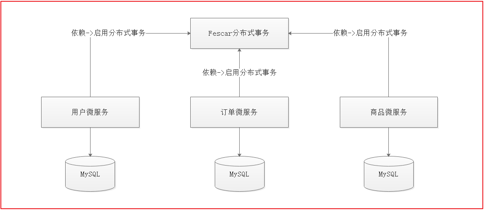
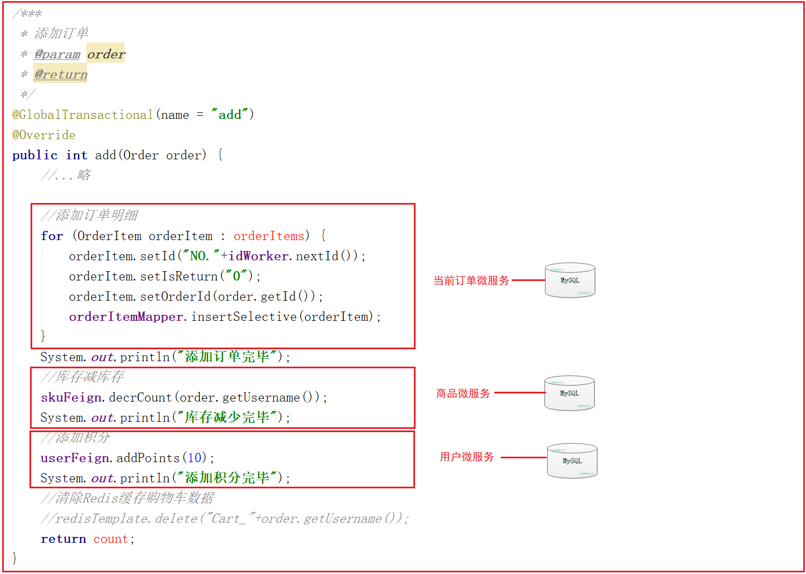
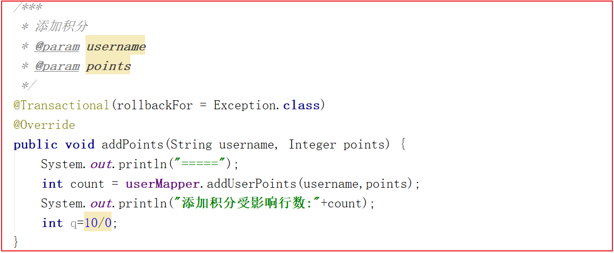
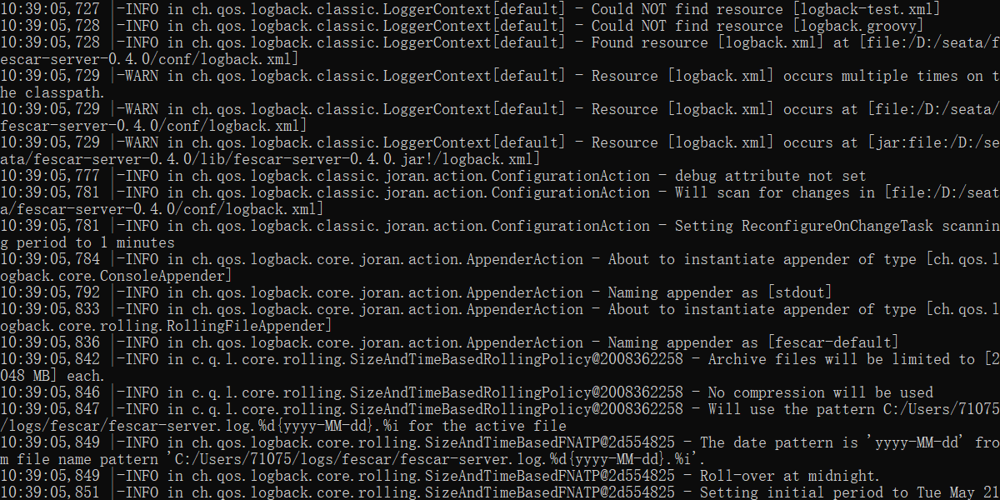

# 第15章 分布式事务

## 学习目标

- 理解什么是事务

- 理解什么是分布式事务

- ==理解CAP定理==

  ```
  CAP不能3者同时成立
  ```

- ==能说出相关的分布式事务解决方案==

  ```
  1.2PC-JTA分布式事务
  2.本地消息-业务库中添加对应的消息表和业务耦合实现
  3.MQ事务消息-RocketMQ
  4.Seata
  ```

- ==理解Seata工作流程==

  ```
  AT模式-表
  TCC模式-代码补偿机制
  ```

- 能实现Seata案例

  ```
  Seata使用案例
  ```


作业：实现项目中分布式事务控制-下单->用户微服务（增加积分）->Goods微服务(库存递减)


## 1 分布式事务介绍

### 1.1 什么是事务

数据库事务(简称：事务，Transaction)是指数据库执行过程中的一个逻辑单位，由一个有限的数据库操作序列构成[由当前业务逻辑多个不同操作构成]。

事务拥有以下四个特性，习惯上被称为ACID特性：

**原子性(Atomicity)**：事务作为一个整体被执行，包含在其中的对数据库的操作要么全部被执行，要么都不执行。

**一致性(Consistency)**：事务应确保数据库的状态从一个一致状态转变为另一个一致状态。**一致状态是指数据库中的数据应满足完整性约束**。除此之外，一致性还有另外一层语义，就是事务的中间状态不能被观察到(这层语义也有说应该属于原子性)。

**隔离性(Isolation)**：**多个事务并发执行时，一个事务的执行不应影响其他事务的执行**，如同只有这一个操作在被数据库所执行一样。

**持久性(Durability)**：已被提交的事务对数据库的修改应该永久保存在数据库中。**在事务结束时，此操作将不可逆转。**


### 1.2 本地事务

**起初，事务仅限于对单一数据库资源的访问控制,架构服务化以后，事务的概念延伸到了服务中**。倘若将**一个单一的服务操作作为一个事务，那么整个服务操作只能涉及一个单一的数据库资源**,这类基于单个服务单一数据库资源访问的事务，被称为**本地事务**(Local Transaction)。 


### 1.3 什么是分布式事务

**分布式事务指事务的参与者、支持事务的服务器、资源服务器以及事务管理器分别位于不同的分布式系统的不同节点之上,且属于不同的应用**，分布式事务需要保证这些操作要么全部成功，要么全部失败。本质上来说，分布式事务就是**为了保证不同数据库的数据一致性**。


### 1.4 分布式事务应用架构

本地事务主要限制在单个会话内，不涉及多个数据库资源。但是在**基于SOA(Service-Oriented Architecture，面向服务架构)的分布式应用环境下**，**越来越多的应用要求对多个数据库资源，多个服务的访问都能纳入到同一个事务当中**，分布式事务应运而生。 


#### 1.4.1 单一服务分布式事务

**最早的分布式事务应用架构很简单，不涉及服务间的访问调用**，仅仅是**服务内操作涉及到对多个数据库资源的访问。即一个服务中的事务操作，不涉及调用其他服务的操作。** 


#### 1.4.2 多服务分布式事务

当一个服务操作访问不同的数据库资源，又希望对它们的访问具有事务特性时，就需要采用分布式事务来协调所有的事务参与者。

对于上面介绍的分布式事务应用架构，尽管一个服务操作会访问多个数据库资源，但是毕竟整个事务还是控制在单一服务的内部。**如果一个服务操作需要调用另外一个服务，这时的事务就需要跨越多个服务了**。在这种情况下，**起始于某个服务的事务在调用另外一个服务的时候，需要以某种机制流转到另外一个服务，从而使被调用的服务访问的资源也自动加入到该事务当中来**。下图反映了这样一个跨越多个服务的分布式事务：


#### 1.4.3 多服务多数据源分布式事务

如果将上面这两种场景(一个服务可以调用多个数据库资源，也可以调用其他服务)结合在一起，对此进行延伸，整个分布式事务的参与者将会组成如下图所示的**树形拓扑结构**。**在一个跨服务的分布式事务中，事务的发起者和提交均系同一个，它可以是整个调用的客户端，也可以是客户端最先调用的那个服务**。 


较之基于单一数据库资源访问的本地事务，分布式事务的应用架构更为复杂。在不同的分布式应用架构下，实现一个分布式事务要考虑的问题并不完全一样，比如**对多资源的协调、事务的跨服务传播**等，实现机制也是复杂多变。 


事务的作用：

```
保证每个事务的数据一致性。
```


### 1.5 CAP定理

**CAP 定理，又被叫作布鲁尔定理**。对于**设计分布式系统**(不仅仅是分布式事务)的架构师来说，CAP 就是你的入门理论。

**C (一致性)：**对某个指定的客户端来说，读操作能返回最新的写操作。

**对于数据分布在不同节点上的数据来说，如果在某个节点更新了数据，那么在其他节点如果都能读取到这个最新的数据，那么就称为强一致，如果有某个节点没有读取到，那就是分布式不一致。**

**A (可用性)：**非故障的节点在合理的时间内返回合理的响应(不是错误和超时的响应)。**可用性的两个关键一个是合理的时间，一个是合理的响应。**

合理的时间指的是**请求不能无限被阻塞**，应该在合理的时间给出返回。**合理的响应指的是系统应该明确返回结果并且结果是正确的**，这里的正确指的是比如应该返回 50，而不是返回 40。

**P (分区容错性)：**当**出现网络分区后，即在不同的网络中，系统能够继续工作**。打个比方，这里**集群有多台机器，有台机器网络出现了问题，但是这个集群仍然可以正常工作。**

熟悉 CAP 的人都知道，**三者不能共有**，如果感兴趣可以搜索 CAP 的证明，**在分布式系统中，网络无法 100% 可靠，分区其实是一个必然现象。**

**如果我们选择了 CA 而放弃了 P，那么当发生分区现象时，不同网络分区之间是断开连接的，这样不同分区之间就无法进行同步操作，为了保证一致性，这个时候必须拒绝请求，但是 A 又不允许，所以分布式系统理论上不可能选择 CA 架构，只能选择 CP 或者 AP 架构。**

**对于 CP 来说，放弃可用性，追求一致性和分区容错性**，我们的 **ZooKeeper** 其实就是追求的**强一致**，**ZooKeeper集群中的各个节点的数据都是一致的，如果分散在不同的网络中，则每个服务就不会是可用的了。**

**对于Eureka来说，使用的是AP，放弃一致性，即Eureka集群中各个节点的数据是不一致的，但是各个节点都是可用的，且能够分布在不同的网络中。**

对于 AP 来说，放弃一致性(这里说的一致性是强一致性)，追求分区容错性和可用性，**这是很多分布式系统设计时的选择，后面的 BASE 也是根据 AP 来扩展**。

顺便一提，**CAP 理论中是忽略网络延迟，也就是当事务提交时，从节点 A 复制到节点 B 没有延迟，但是在现实中这个是明显不可能的，所以总会有一定的时间是不一致。**

同时 CAP 中选择两个，比如你选择了 CP，并不是叫你放弃 A。因为 P 出现的概率实在是太小了，大部分的时间你仍然需要保证 CA。

**就算分区出现了你也要为后来的 A 做准备，比如通过一些日志的手段，使其他机器回复至可用。**

****


## ==2 分布式事务解决方案==

1.XA两段提交(低效率)-21 XA JTA分布式事务解决方案

2.TCC三段提交(2段,高效率[不推荐(补偿代码)])

3.本地消息(MQ+Table)

4.事务消息(RocketMQ[alibaba])

5.Seata(alibaba)


### 2.1  基于XA协议的两阶段提交(2PC)

**两阶段提交协议**(Two Phase Commitment Protocol)中，涉及到两种角色

==一个**事务协调者**==（coordinator）：**负责协调多个参与者进行事务投票及提交(回滚)**
**多个==事务参与者==（participants）：即本地事务执行者**

总共处理步骤有两个
（1）**投票阶段**（voting phase）：**协调者将通知事务参与者准备提交或取消事务，然后进入表决过程。参与者将告知协调者自己的决策：同意（事务参与者本地事务执行成功，但未提交，预提交状态）或取消（本地事务执行故障）；**
**（2）提交阶段（commit phase）：收到参与者的通知后，协调者再向参与者发出通知，根据反馈情况决定各参与者是否要提交还是回滚；**

如果所示 1-2为第一阶段，2-3为第二阶段


**如果任一资源管理器在第一阶段返回准备失败，那么事务管理器会要求所有资源管理器在第二阶段执行回滚操作。通过事务管理器的两阶段协调，最终所有资源管理器要么全部提交，要么全部回滚，最终状态都是一致的**

官方解决方案图例如下:


 

**优点：** **尽量保证了数据的强一致，适合对数据强一致要求很高的关键领域。**

**缺点：** **牺牲了可用性，对性能影响较大，不适合高并发高性能场景**，如果分布式系统跨接口调用，目前 .NET 界还没有实现方案。

 

### 2.2 补偿（代码补偿）事务（TCC）（3PC）

**TCC 将事务提交分为** Try(method1) - Confirm(method2) - Cancel(method3) **3个操作**。其和两阶段提交有点类似，**Try为第一阶段，Confirm - Cancel为第二阶段，是一种应用层面侵入业务的两阶段提交。**

| 操作方法 | 含义                                                         |
| -------- | ------------------------------------------------------------ |
| Try      | **预留业务资源/数据效验，如要执行A对B的转账业务，首先调用A服务的Try接口方法（自定义），检查A的存款数量；然后调用B服务的Try接口方法（自定义），检查B是否存在。** |
| Confirm  | **如果Try方法执行成功，则继续执行Confirm业务操作，实际提交数据，不做任何业务检查，try成功，confirm必定成功，需保证幂等。即实际的转账操作是由A服务和B服务的Confirm接口完成的，这些接口就是微服务中的自定义方法。幂等性的意思是 当多个相同的请求访问一个服务时，该服务返回的结果应该是相同的，如删除同一个数据，多次删除与删除一次应该是结果一致的。** |
| Cancel   | **如果Try方法失败，则执行Cancel接口取消执行业务操作，但是它并不需要进行回滚操作，因为Try 只是检查了数据，而没有执行真正的业务操作，Try只是用一个锁将该数据锁起来了，Cancel操作只需要将这个锁释放掉即可，需保证幂等。** |

其核心在于**将业务分为两个操作步骤完成**。不依赖 RM 对分布式事务的支持，**而是通过对业务逻辑的分解来实现分布式事务。**


例如： A要向 B 转账，思路大概是： 

```
我们有一个本地方法，里面依次调用 
1、首先在 Try 阶段，要先调用远程接口把 B和 A的钱给冻结起来。 
2、在 Confirm 阶段，执行远程调用的转账的操作，转账成功进行解冻。 
3、如果第2步执行成功，那么转账成功，如果第二步执行失败，则调用远程冻结接口对应的解冻方法 (Cancel)。 
```


```properties
假设用户user表中有两个字段：可用余额(available_money)、冻结余额(frozen_money)
A扣钱对应服务A(ServiceA)
B加钱对应服务B(ServiceB)
转账订单服务(OrderService)
业务转账方法服务(BusinessService)
```

ServiceA，ServiceB，OrderService都需分别实现try()，confirm()，cancle()方法，方法对应业务逻辑如下

| 操作方法  | **ServiceA**                                       | **ServiceB**  | **OrderService**         |
| --------- | -------------------------------------------------- | ------------- | ------------------------ |
| try()     | 校验余额(并发控制)<br/>冻结余额+1000<br/>余额-1000 | 冻结余额+1000 | 创建转账订单，状态待转账 |
| confirm() | 冻结余额-1000                                      |               | 状态变为转账成功         |
| cancle()  | 冻结余额-1000<br/>余额+1000                        |               | 状态变为转账失败         |

其中业务调用方BusinessService中就需要调用
ServiceA.try()
ServiceB.try()
OrderService.try()

1、**当所有try()方法均执行成功时，对全局事务进行提交，即由事务管理器调用每个微服务的confirm()方法**

2、 当**任意一个方法try()失败**(预留资源不足，抑或网络异常，代码异常等任何异常)，**由事务管理器调用每个微服务的cancle()方法对全局事务进行回滚**


**优点：** **跟2PC（更多的第三方框架）比起来，实现以及流程相对简单了一些，所有的接口由自己定义，但数据的一致性比2PC也要差一些。**

**缺点：** 缺点还是比较明显的，**在2,3步中都有可能失败，导致数据的不一致问题**。**TCC属于应用层的一种补偿方式，所以需要程序员在实现的时候多写很多补偿的代码**，在一些场景中，一些业务流程可能用TCC不太好定义及处理。


### 2.3 本地消息表（异步确保）

**本地消息表**这种实现方式应该是**业界使用最多的**，**其核心思想是将分布式事务拆分成本地事务进行处理**，这种思路是来源于ebay。我们可以从下面的流程图中看出其中的一些细节： 


基本思路就是：

**消息生产方，需要额外建一个消息表，并记录消息发送状态**。**消息表和业务数据要在一个事务里提交**，也就是说他们要**在一个数据库里面**。然后消息会**经过MQ发送到消息的消费方**。如果消息发送失败，会进行重试发送。

**消息消费方，需要处理这个消息，并完成自己的业务逻辑**。**此时如果本地事务处理成功，表明已经处理成功了，如果处理失败，那么就会重试执行。如果是业务上面的失败，可以给生产方发送一个业务补偿消息，通知生产方进行回滚等操作。**

**生产方和消费方定时扫描本地消息表，把还没处理完成的消息或者失败的消息再发送一遍。**如果有靠谱的自动对账补账逻辑，这种方案还是非常实用的。

**这种方案遵循BASE理论，采用的是最终一致性**，笔者认为是这几种方案里面**比较适合实际业务场景的，即不会出现像2PC那样复杂的实现(当调用链很长的时候，2PC的可用性是非常低的)**，**也不会像TCC那样可能出现确认或者回滚不了的情况。**

**优点：** 一种非常经典的实现，**避免了分布式事务，实现了最终一致性**。在 .NET中 有现成的解决方案。

**缺点：** **消息表会耦合到业务系统中**，如果没有封装好的解决方案，会有很多杂活需要处理。


### 2.4 MQ 事务消息

有一些第三方的MQ是**支持事务消息的，比如RocketMQ**，他们支持事务消息的方式也是类似于**采用的二阶段提交**，但是市面上一些主流的MQ都是不支持事务消息的，比如 RabbitMQ 和 Kafka 都不支持。

以阿里的 RocketMQ 中间件为例，其思路大致为：

第一阶段Prepared消息，会拿到消息的地址。MQ发送方发送Half消息给MQ Server，Server返回确认给发送方；
第二阶段，本地的MQ发送方收到确认后，执行本地事务，如果执行成功，则发送事务提交成功给MQ Server，Server再将消息转发给MQ订阅方；如果事务执行失败，MQ Server会定期检查MQ发送方的事务状态，择机进行事务回滚。

也就是说在业务方法内要想消息队列提交两次请求，一次发送消息和一次确认消息。**如果确认消息发送失败了RocketMQ会定期扫描消息集群中的事务消息，这时候发现了Prepared消息，它会向消息发送者确认**，**所以生产方需要实现一个check接口，用于检查本地事务的执行状态，RocketMQ会根据发送端设置的策略来决定是回滚还是继续发送确认消息**。这样就**保证了消息发送与本地事务同时成功或同时失败，只有事务执行成功时才会发送确认消息给MQ Server**。


**优点：** **实现了最终一致性，不需要依赖本地数据库事务，即不需要再业务系统中创建一个事务状态表。**

**缺点：** 目前主流MQ中**只有RocketMQ支持事务消息。**


### 2.5 Seata   2PC->改进

2019 年 1 月，阿里巴巴中间件团队发起了开源项目 [*Fescar*](https://www.oschina.net/p/fescar)*（Fast & EaSy Commit And Rollback）*，和社区一起共建**开源分布式事务解决方案**。Fescar 的愿景是让分布式事务的使用像本地事务的使用一样，简单和高效，并逐步解决开发者们遇到的分布式事务方面的所有难题。

**Fescar 开源后，蚂蚁金服加入 Fescar 社区参与共建，并在 Fescar 0.4.0 版本中贡献了 TCC 模式。**

为了打造更中立、更开放、生态更加丰富的分布式事务开源社区，经过社区核心成员的投票，大家决定对 Fescar 进行品牌升级，并更名为 **Seata**，意为：**Simple Extensible Autonomous Transaction Architecture**，是一套一站式分布式事务解决方案。

Seata 融合了阿里巴巴和蚂蚁金服在分布式事务技术上的积累，并沉淀了新零售、云计算和新金融等场景下丰富的实践经验。


#### 2.5.1 Seata介绍

解决分布式事务问题，有**两个设计初衷**

**对业务无侵入**：即**减少技术架构上的微服务化所带来的分布式事务问题对业务的侵入**
**高性能**：**减少分布式事务解决方案所带来的性能消耗**

seata中有**两种分布式事务实现方案，AT及TCC**

- AT模式**主要关注多 DB 访问的数据一致性**，当然也包括多服务下的多 DB 数据访问一致性问题**（2PC的改进，更加简单）**

- TCC 模式**主要关注业务拆分**，在按照业务横向扩展资源时，解决微服务间调用的一致性问题（更多的代码）


#### 2.5.2 AT模式

**Seata AT模式**是**基于XA事务演进**而来的一个**分布式事务中间件**，**XA是一个基于数据库实现的分布式事务协议，本质上和两阶段提交一样，需要数据库支持**，Mysql5.6以上版本支持XA协议，其他数据库如Oracle，DB2也实现了XA接口


解释：

**Transaction Coordinator (TC)**： **事务协调器，维护全局事务的运行状态，负责协调并驱动（决定）全局事务的提交或回滚。**
**Transaction Manager（TM）**： **控制全局事务的边界，负责开启一个全局事务，并最终发起全局提交或全局回滚的决议。**
**Resource Manager (RM)**： **控制分支本地事务，负责分支在TC中的注册、分支向RM进行状态汇报（投票），并接收事务协调器（TC）的指令，驱动分支（本地）事务的提交和回滚。**

协调执行流程如下：


**Branch就是指的分布式事务中每个独立的本地局部事务，可以看到，首先RM将本地事务注册到TC中，接着向TC报告本地事务的执行状态，即投票，TC根据全局事务中各个本地事务的投票情况，决定对所有的本地事务进行提交或回滚，这个操作首先发送给RM，然后再由RM驱动各个本地事务操作。**


**第一阶段**

每个本地事务所在的微服务数据库中一定都有一个**undo_log表，用于保存着业务数据在更新之前的快照状态，即回滚日志表**， Seata 的 **JDBC 数据源代理会通过对业务 SQL 进行解析**，**把需要修改的业务数据在更新前后的数据镜像组织成回滚日志，然后生成行级锁锁定修改的数据，**利用 **本地事务 的 ACID 特性，将业务数据的更新和回滚日志的写入在同一个 本地事务 中提交。**

这样，可以保证：**任何提交的业务数据的更新一定有相应的回滚日志存在，**


基于这样的机制，**如果事务能够成功执行，分支的本地事务便可以在全局事务的第一阶段提交，并马上释放本地事务锁定的资源。然后发送本地事务执行成功消息给RM，RM再通知TC。**

这也是Seata和XA事务的不同之处，**XA这种两阶段提交往往对资源的锁定需要持续到第二阶段实际的提交或者回滚操作**，而**有了回滚日志之后，可以在第一阶段释放对资源的锁定，降低了锁范围，提高效率，即使第二阶段发生异常需要回滚，只需找对undolog中对应数据并反解析成sql来达到回滚目的，即恢复修改之前的数据即可。**

同时Seata**通过代理数据源将业务sql的执行解析成undolog来与业务数据的更新同时入库，达到了对业务无侵入的效果。**


**第二阶段**

当所有的本地事务都将自己的执行结果发送给TC后，**如果TC的决议是全局提交，此时分支事务此时已经完成提交，不需要同步协调处理（只需要异步清理回滚日志，删除行级锁），Phase2 可以非常快速地完成.**


**如果决议是全局回滚，RM 收到协调器发来的回滚请求**，**由于本地事务一定是由多线程执行的，多个线程并发执行该方法，如何判断应该回滚哪个线程的修改操作，以及如何判断应该使用回滚日志中的哪条数据呢**？ 

**通过 XID 和 Branch ID 找到相应的回滚日志记录**，**通过回滚记录生成反向的更新 SQL 并执行**，以完成分支的回滚。**XID是多线程请求本地方法时线程的ID，在微服务调用链中，将该线程ID发送到调用链的每一个微服务中，最后发送给TC，当TC决定全局回滚时，会发送回滚请求给每个RM，在这个请求中就可以将这个线程ID携带着，每个RM根据这个线程ID就可以找到回滚日志中的某个数据进行回滚操作。**


#### 2.5.3 TCC模式

seata也针对TCC做了适配兼容，支持TCC事务方案，原理前面已经介绍过，基本思路就是使用侵入业务上的补偿及事务管理器的协调来达到全局事务的一起提交及回滚。


## 3 Seata案例

### 3.1 需求分析


**完成一个案例，用户下单的时候记录下单日志，完成订单添加，完成用户账户扣款，完成商品库存削减功能，一会在任何一个微服务中制造异常，测试分布式事务。**

先将`day15\seata\案例SQL脚本`数据库脚本导入到数据库中。


### 3.2 案例实现

fescar:fast easy commit and rollback


#### 3.2.1 父工程

搭建fescar-parent,为了适应我们畅购工程的分布式事务，我们这里的父工程引入和畅购工程一样的依赖包。

pom.xml依赖如下：

````xml
<?xml version="1.0" encoding="UTF-8"?>
<project xmlns="http://maven.apache.org/POM/4.0.0"
         xmlns:xsi="http://www.w3.org/2001/XMLSchema-instance"
         xsi:schemaLocation="http://maven.apache.org/POM/4.0.0 http://maven.apache.org/xsd/maven-4.0.0.xsd">
    <modelVersion>4.0.0</modelVersion>

    <groupId>com.itheima</groupId>
    <artifactId>fescar-parent</artifactId>
    <version>1.0-SNAPSHOT</version>

    <parent>
        <groupId>org.springframework.boot</groupId>
        <artifactId>spring-boot-starter-parent</artifactId>
        <version>2.1.4.RELEASE</version>
    </parent>

    <packaging>pom</packaging>

    <!--跳过测试-->
    <properties>
        <skipTests>true</skipTests>
    </properties>

    <!--依赖包-->
    <dependencies>
        <!--测试包-->
        <dependency>
            <groupId>org.springframework.boot</groupId>
            <artifactId>spring-boot-starter-test</artifactId>
        </dependency>

        <!--fastjson-->
        <dependency>
            <groupId>com.alibaba</groupId>
            <artifactId>fastjson</artifactId>
            <version>1.2.51</version>
        </dependency>

        <!--鉴权-->
        <dependency>
            <groupId>io.jsonwebtoken</groupId>
            <artifactId>jjwt</artifactId>
            <version>0.9.0</version>
        </dependency>

        <!--web起步依赖-->
        <dependency>
            <groupId>org.springframework.boot</groupId>
            <artifactId>spring-boot-starter-web</artifactId>
        </dependency>

        <!-- redis 使用-->
        <dependency>
            <groupId>org.springframework.boot</groupId>
            <artifactId>spring-boot-starter-data-redis</artifactId>
        </dependency>

        <!--eureka-client-->
        <dependency>
            <groupId>org.springframework.cloud</groupId>
            <artifactId>spring-cloud-starter-netflix-eureka-client</artifactId>
        </dependency>

        <!--openfeign-->
        <dependency>
            <groupId>org.springframework.cloud</groupId>
            <artifactId>spring-cloud-starter-openfeign</artifactId>
        </dependency>

        <!--微信支付-->
        <dependency>
            <groupId>com.github.wxpay</groupId>
            <artifactId>wxpay-sdk</artifactId>
            <version>0.0.3</version>
        </dependency>

        <!--httpclient支持,微信支付-->
        <dependency>
            <groupId>org.apache.httpcomponents</groupId>
            <artifactId>httpclient</artifactId>
        </dependency>

        <!--通用mapper起步依赖,MyBatis通用Mapper封装，基于MyBatis动态SQL实现,可以实现对数据库的操作，不需要编写SQL语句-->
        <dependency>
            <groupId>tk.mybatis</groupId>
            <artifactId>mapper-spring-boot-starter</artifactId>
            <version>2.0.4</version>
        </dependency>

        <!--MySQL数据库驱动-->
        <dependency>
            <groupId>mysql</groupId>
            <artifactId>mysql-connector-java</artifactId>
        </dependency>

        <!--mybatis分页插件,用于解决数据库分页实现  PageHelper.start(当前页，每页显示的条数)-->
        <dependency>
            <groupId>com.github.pagehelper</groupId>
            <artifactId>pagehelper-spring-boot-starter</artifactId>
            <version>1.2.3</version>
        </dependency>
    </dependencies>

    <dependencyManagement>
        <dependencies>
            <dependency>
                <groupId>org.springframework.cloud</groupId>
                <artifactId>spring-cloud-dependencies</artifactId>
                <version>Greenwich.SR1</version>
                <type>pom</type>
                <scope>import</scope>
            </dependency>
        </dependencies>
    </dependencyManagement>
</project>
````


#### 3.2.2 公共工程

将所有数据库对应的Pojo/Feign抽取出一个公共工程`fescar-api`,在该工程中导入依赖:

pom.xml

```xml
<?xml version="1.0" encoding="UTF-8"?>
<project xmlns="http://maven.apache.org/POM/4.0.0"
         xmlns:xsi="http://www.w3.org/2001/XMLSchema-instance"
         xsi:schemaLocation="http://maven.apache.org/POM/4.0.0 http://maven.apache.org/xsd/maven-4.0.0.xsd">
    <parent>
        <artifactId>fescar-parent</artifactId>
        <groupId>com.itheima</groupId>
        <version>1.0-SNAPSHOT</version>
    </parent>
    <modelVersion>4.0.0</modelVersion>
    <description>
        API:Model和Feign
    </description>
    <artifactId>fescar-api</artifactId>
</project>
```

将Pojo导入到工程中


#### 3.2.3 商品微服务

创建`fescar-item`微服务，在该工程中实现库存削减。

(1)pom.xml

```xml
<?xml version="1.0" encoding="UTF-8"?>
<project xmlns="http://maven.apache.org/POM/4.0.0"
         xmlns:xsi="http://www.w3.org/2001/XMLSchema-instance"
         xsi:schemaLocation="http://maven.apache.org/POM/4.0.0 http://maven.apache.org/xsd/maven-4.0.0.xsd">
    <parent>
        <artifactId>fescar-parent</artifactId>
        <groupId>com.itheima</groupId>
        <version>1.0-SNAPSHOT</version>
    </parent>
    <modelVersion>4.0.0</modelVersion>
    <artifactId>fescar-item</artifactId>

    <dependencies>
        <dependency>
            <groupId>com.itheima</groupId>
            <artifactId>fescar-api</artifactId>
            <version>1.0-SNAPSHOT</version>
        </dependency>
    </dependencies>
</project>
```


(2)Dao

创建`com.itheima.dao.ItemInfoMapper`,代码如下：

```java
public interface ItemInfoMapper extends Mapper<ItemInfo> {
}
```


(3)Service

创建`com.itheima.service.ItemInfoService`接口，并创建库存递减方法，代码如下：

```java
public interface ItemInfoService {

    /**
     * 库存递减
     * @param id
     * @param count
     */
    void decrCount(int id, int count);
}
```

创建`com.itheima.service.impl.ItemInfoServiceImpl`实现库存递减操作，代码如下：

```java
@Service
public class ItemInfoServiceImpl implements ItemInfoService {

    @Autowired
    private ItemInfoMapper itemInfoMapper;

    /***
     * 库存递减
     * @param id
     * @param count
     */
    @Transactional(rollbackFor = Exception.class)
    @Override
    public void decrCount(int id, int count) {
        //查询商品信息
        ItemInfo itemInfo = itemInfoMapper.selectByPrimaryKey(id);
        itemInfo.setCount(itemInfo.getCount()-count);
        int dcount = itemInfoMapper.updateByPrimaryKeySelective(itemInfo);
        System.out.println("库存递减受影响行数："+dcount);
        //异常准备回滚
        //int q=10/0;
    }
}
```


(4)Controller

创建`com.itheima.controller.ItemInfoController`，代码如下：

```java
@RestController
@RequestMapping("/itemInfo")
@CrossOrigin
public class ItemInfoController {

    @Autowired
    private ItemInfoService itemInfoService;

    /**
     * 库存递减
     * @param id
     * @param count
     * @return
     */
    @PostMapping(value = "/decrCount")
    public String decrCount(@RequestParam(value = "id") int id, @RequestParam(value = "count") int count){
        //库存递减
        itemInfoService.decrCount(id,count);
        return "success";
    }
}
```


(5)启动类

创建`com.itheima.ItemApplication`代码如下：

```java
@SpringBootApplication
@EnableEurekaClient
@EnableFeignClients(basePackages = {"com.itheima.feign"})
@MapperScan(basePackages = {"com.itheima.dao"})
public class ItemApplication {

    public static void main(String[] args) {
        SpringApplication.run(ItemApplication.class,args);
    }
}
```


(6)application.yml

创建applicatin.yml,配置如下：

```properties
server:
  port: 18082
spring:
  application:
    name: item
  datasource:
    driver-class-name: com.mysql.jdbc.Driver
    url: jdbc:mysql://192.168.211.132:3306/fescar-item?useUnicode=true&characterEncoding=UTF-8&serverTimezone=UTC
    username: root
    password: 123456
  main:
    allow-bean-definition-overriding: true
eureka:
  client:
    service-url:
      defaultZone: http://127.0.0.1:7001/eureka
  instance:
    prefer-ip-address: true
feign:
  hystrix:
    enabled: true
#hystrix 配置
hystrix:
  command:
    default:
      execution:
        isolation:
          thread:
            timeoutInMilliseconds: 10000
          strategy: SEMAPHORE
```


#### 3.2.4 用户微服务

创建`fescar-user`微服务，并引入公共工程依赖。

(1)pom.xml

```xml
<?xml version="1.0" encoding="UTF-8"?>
<project xmlns="http://maven.apache.org/POM/4.0.0"
         xmlns:xsi="http://www.w3.org/2001/XMLSchema-instance"
         xsi:schemaLocation="http://maven.apache.org/POM/4.0.0 http://maven.apache.org/xsd/maven-4.0.0.xsd">
    <parent>
        <artifactId>fescar-parent</artifactId>
        <groupId>com.itheima</groupId>
        <version>1.0-SNAPSHOT</version>
    </parent>
    <modelVersion>4.0.0</modelVersion>
    <artifactId>fescar-user</artifactId>

    <dependencies>
        <dependency>
            <groupId>com.itheima</groupId>
            <artifactId>fescar-api</artifactId>
            <version>1.0-SNAPSHOT</version>
        </dependency>
    </dependencies>

</project>
```


(2)Dao

创建`com.itheima.dao.UserInfoMapper`，代码如下：

```java
public interface UserInfoMapper extends Mapper<UserInfo> {
}
```


(3)Service

创建`com.itheima.service.UserInfoService`接口，代码如下：

```java
public interface UserInfoService {

    /***
     * 账户金额递减
     * @param username
     * @param money
     */
    void decrMoney(String username, int money);
}
```

创建`com.itheima.service.impl.UserInfoServiceImpl`实现用户账户扣款，代码如下：

```java
@Service
public class UserInfoServiceImpl implements UserInfoService {

    @Autowired
    private UserInfoMapper userInfoMapper;

    /***
     * 账户金额递减
     * @param username
     * @param money
     */
    @Transactional(rollbackFor = Exception.class)
    @Override
    public void decrMoney(String username, int money) {
        UserInfo userInfo = userInfoMapper.selectByPrimaryKey(username);
        userInfo.setMoney(userInfo.getMoney()-money);
        int count = userInfoMapper.updateByPrimaryKeySelective(userInfo);
        System.out.println("添加用户受影响行数："+count);
        //int q=10/0;
    }
}
```

(4)Controller

创建`com.itheima.controller.UserInfoController`代码如下：

```java
@RestController
@RequestMapping("/userInfo")
@CrossOrigin
public class UserInfoController {

    @Autowired
    private UserInfoService userInfoService;

    /***
     * 账户余额递减
     * @param username
     * @param money
     */
    @PostMapping(value = "/add")
    public String decrMoney(@RequestParam(value = "username") String username, @RequestParam(value = "money") int money){
        userInfoService.decrMoney(username,money);
        return "success";
    }

}
```


(5)启动类

创建`com.itheima.UserApplication`，代码如下：

```java
@SpringBootApplication
@EnableEurekaClient
@EnableFeignClients(basePackages = {"com.itheima.feign"})
@MapperScan(basePackages = {"com.itheima.dao"})
public class UserApplication {

    public static void main(String[] args) {
        SpringApplication.run(UserApplication.class,args);
    }
}
```


(6)application.yml

创建application.yml配置如下：

```properties
server:
  port: 18084
spring:
  application:
    name: user
  datasource:
    driver-class-name: com.mysql.jdbc.Driver
    url: jdbc:mysql://192.168.211.132:3306/fescar-user?useUnicode=true&characterEncoding=UTF-8&serverTimezone=UTC
    username: root
    password: 123456
  main:
    allow-bean-definition-overriding: true
eureka:
  client:
    service-url:
      defaultZone: http://127.0.0.1:7001/eureka
  instance:
    prefer-ip-address: true
feign:
  hystrix:
    enabled: true
#hystrix 配置
hystrix:
  command:
    default:
      execution:
        isolation:
          thread:
            timeoutInMilliseconds: 10000
          strategy: SEMAPHORE
```


#### 3.2.5 订单微服务

在订单微服务中实现调用商品微服务递减库存。

(1)pom.xml

```xml
<?xml version="1.0" encoding="UTF-8"?>
<project xmlns="http://maven.apache.org/POM/4.0.0"
         xmlns:xsi="http://www.w3.org/2001/XMLSchema-instance"
         xsi:schemaLocation="http://maven.apache.org/POM/4.0.0 http://maven.apache.org/xsd/maven-4.0.0.xsd">
    <parent>
        <artifactId>fescar-parent</artifactId>
        <groupId>com.itheima</groupId>
        <version>1.0-SNAPSHOT</version>
    </parent>
    <modelVersion>4.0.0</modelVersion>
    <artifactId>fescar-order</artifactId>

    <dependencies>
        <dependency>
            <groupId>com.itheima</groupId>
            <artifactId>fescar-api</artifactId>
            <version>1.0-SNAPSHOT</version>
        </dependency>
    </dependencies>
</project>
```


(2)Dao

创建`com.itheima.dao.OrderInfoMapper`，代码如下：

```java
public interface OrderInfoMapper extends Mapper<OrderInfo> {
}
```


(3)Service

创建`com.itheima.service.OrderInfoService`实现添加订单操作，代码如下：

```java
public interface OrderInfoService {

    /***
     * 添加订单
     * @param username
     * @param id
     * @param count
     */
    void add(String username, int id, int count);
}
```

创建`com.itheima.service.impl.OrderInfoServiceImpl`，代码如下：

```java
@Service
public class OrderInfoServiceImpl implements OrderInfoService {

    @Autowired
    private OrderInfoMapper orderInfoMapper;

    @Autowired
    private ItemInfoFeign itemInfoFeign;

    /***
     * 添加订单
     * @param username
     * @param id
     * @param count
     */
    @Override
    public void add(String username, int id, int count) {
        //添加订单
        OrderInfo orderInfo = new OrderInfo();
        orderInfo.setMessage("生成订单");
        orderInfo.setMoney(10);
        int icount = orderInfoMapper.insertSelective(orderInfo);
        System.out.println("添加订单受影响函数："+icount);

        //递减库存
        itemInfoFeign.decrCount(id,count);
    }
}
```


(3)Controller

创建`com.itheima.controller.OrderInfoController`调用下单操作，代码如下：

```java
@RestController
@RequestMapping("/orderInfo")
@CrossOrigin
public class OrderInfoController {

    @Autowired
    private OrderInfoService orderInfoService;

    /**
     * 增加订单
     * @param username
     * @param id
     * @param count
     */
    @PostMapping(value = "/add")
    public String add(@RequestParam(value = "name") String username, @RequestParam(value = "id") int id, @RequestParam(value = "count") int count){
        //添加订单
        orderInfoService.add(username,id,count);
        return "success";
    }

}
```


(4)启动类

创建`com.itheima.OrderApplication`启动类，代码如下：

```java
@SpringBootApplication
@EnableEurekaClient
@EnableFeignClients(basePackages = {"com.itheima.feign"})
@MapperScan(basePackages = {"com.itheima.dao"})
public class OrderApplication {

    public static void main(String[] args) {
        SpringApplication.run(OrderApplication.class,args);
    }
}
```


(5)application.yml配置

```properties
server:
  port: 18083
spring:
  application:
    name: order
  datasource:
    driver-class-name: com.mysql.jdbc.Driver
    url: jdbc:mysql://192.168.211.132:3306/fescar-order?useUnicode=true&characterEncoding=UTF-8&serverTimezone=UTC
    username: root
    password: 123456
  main:
    allow-bean-definition-overriding: true
eureka:
  client:
    service-url:
      defaultZone: http://127.0.0.1:7001/eureka
  instance:
    prefer-ip-address: true
feign:
  hystrix:
    enabled: true
#hystrix 配置
hystrix:
  command:
    default:
      execution:
        isolation:
          thread:
            timeoutInMilliseconds: 10000
          strategy: SEMAPHORE
```


#### 3.2.6 业务微服务

创建`fescar-business`业务微服务，**在该微服务中实现分布式事务控制，下单入口从这里开始。**

（1）pom.xml

```xml
<?xml version="1.0" encoding="UTF-8"?>
<project xmlns="http://maven.apache.org/POM/4.0.0"
         xmlns:xsi="http://www.w3.org/2001/XMLSchema-instance"
         xsi:schemaLocation="http://maven.apache.org/POM/4.0.0 http://maven.apache.org/xsd/maven-4.0.0.xsd">
    <parent>
        <artifactId>fescar-parent</artifactId>
        <groupId>com.itheima</groupId>
        <version>1.0-SNAPSHOT</version>
    </parent>
    <modelVersion>4.0.0</modelVersion>
    <description>分布式事务业务控制</description>
    <artifactId>fescar-business</artifactId>

    <dependencies>
        <dependency>
            <groupId>com.itheima</groupId>
            <artifactId>fescar-api</artifactId>
            <version>1.0-SNAPSHOT</version>
        </dependency>
    </dependencies>

</project>
```

(2)Dao

创建`com.itheima.dao.LogInfoMapper`代码如下：

```
public interface LogInfoMapper extends Mapper<LogInfo> {
}
```


(3)Service

创建`com.itheima.service.BusinessService`接口，代码如下：

```java
public interface BusinessService {

    /**
     * 下单
     * @param username
     * @param id
     * @param count
     */
    void add(String username, int id, int count);
}
```

创建`com.itheima.service.impl.BusinessServiceImpl`，代码如下：

```java
@Service
public class BusinessServiceImpl implements BusinessService {

    @Autowired
    private OrderInfoFeign orderInfoFeign;

    @Autowired
    private UserInfoFeign userInfoFeign;

    @Autowired
    private LogInfoMapper logInfoMapper;

    /***
     * 下单
     * @param username
     * @param id
     * @param count
     */
    @Override
    public void add(String username, int id, int count) {
        //添加订单日志
        LogInfo logInfo = new LogInfo();
        logInfo.setContent("添加订单数据---"+new Date());
        logInfo.setCreatetime(new Date());
        int logcount = logInfoMapper.insertSelective(logInfo);
        System.out.println("添加日志受影响行数："+logcount);

        //添加订单
        orderInfoFeign.add(username,id,count);

        //用户账户余额递减
        userInfoFeign.decrMoney(username,10);
    }
}
```

(4)Controller

创建`com.itheima.controller.BusinessController`，代码如下：

```java
@RestController
@RequestMapping(value = "/business")
public class BusinessController {

    @Autowired
    private BusinessService businessService;

    /***
     * 购买商品分布式事务测试
     * @return
     */
    @RequestMapping(value = "/addorder")
    public String order(){
        String username="zhangsan";
        int id=1;
        int count=5;
        //下单
        businessService.add(username,id,count);
        return "success";
    }
}
```


(5)启动类

创建启动类`com.itheima.BusinessApplication`，代码如下：

```java
@SpringBootApplication
@EnableEurekaClient
@EnableFeignClients(basePackages = {"com.itheima.feign"})
@MapperScan(basePackages = {"com.itheima.dao"})
public class BusinessApplication {

    public static void main(String[] args) {
        SpringApplication.run(BusinessApplication.class,args);
    }
}
```


(6)application.yml配置

```properties
server:
  port: 18081
spring:
  application:
    name: business
  datasource:
    driver-class-name: com.mysql.jdbc.Driver
    url: jdbc:mysql://192.168.211.132:3306/fescar-business?useUnicode=true&characterEncoding=UTF-8&serverTimezone=UTC
    username: root
    password: 123456
  main:
    allow-bean-definition-overriding: true
eureka:
  client:
    service-url:
      defaultZone: http://127.0.0.1:7001/eureka
  instance:
    prefer-ip-address: true
feign:
  hystrix:
    enabled: true

#读取超时设置
ribbon:
  ReadTimeout: 30000
#hystrix 配置
hystrix:
  command:
    default:
      execution:
        isolation:
          thread:
            timeoutInMilliseconds: 10000
          strategy: SEMAPHORE
```


### 3.3 分布式事务抽取

上面案例，并没有实现分布式事务，**在我们以后工作中，也并非每个服务都需要实现分布式事务，我们可以将分布式事务抽取出来。**

#### 3.3.1 分布式事务工程抽取搭建

创建`fescar-transaction`微服务工程，**在该工程中实现分布式事务控制。**

(1)pom.xml依赖

```xml
<?xml version="1.0" encoding="UTF-8"?>
<project xmlns="http://maven.apache.org/POM/4.0.0"
         xmlns:xsi="http://www.w3.org/2001/XMLSchema-instance"
         xsi:schemaLocation="http://maven.apache.org/POM/4.0.0 http://maven.apache.org/xsd/maven-4.0.0.xsd">
    <parent>
        <artifactId>fescar-parent</artifactId>
        <groupId>com.itheima</groupId>
        <version>1.0-SNAPSHOT</version>
    </parent>
    <modelVersion>4.0.0</modelVersion>
    <description>fescar分布式事务微服务</description>
    <artifactId>fescar-transaction</artifactId>

    <properties>
        <fescar.version>0.4.2</fescar.version>
    </properties>

    <dependencies>
        <!--fescar依赖包-->
        <dependency>
            <groupId>com.alibaba.fescar</groupId>
            <artifactId>fescar-tm</artifactId>
            <version>${fescar.version}</version>
        </dependency>
        <dependency>
            <groupId>com.alibaba.fescar</groupId>
            <artifactId>fescar-spring</artifactId>
            <version>${fescar.version}</version>
        </dependency>
        <dependency>
            <groupId>org.springframework.cloud</groupId>
            <artifactId>spring-cloud-starter</artifactId>
        </dependency>
    </dependencies>
</project>
```


(2)资源文件导入

将`seata\资源包`中的文件导入到该工程中。


相关概念讲解

```properties
XID：全局事务的唯一标识，由 ip:port:sequence 组成；
Transaction Coordinator (TC)：事务协调器，维护全局事务的运行状态，负责协调并驱动全局事务的提交或回滚；
Transaction Manager (TM )：控制全局事务的边界，负责开启一个全局事务，并最终发起全局提交或全局回滚的决议；
Resource Manager (RM)：控制分支事务，负责分支注册、状态汇报，并接收事务协调器的指令，驱动分支（本地）事务的提交和回滚；
```

Fescar 使用 XID 表示一个分布式事务，XID 需要在一次分布式事务请求所涉的系统中进行传递，从而向 feacar-server 发送分支事务的处理情况，以及接收 feacar-server 的 commit、rollback 指令。


#### 3.3.2 配置讲解

fescar 的配置入口文件是 registry.conf, 查看代码 ConfigurationFactory 得知目前还不能指定该配置文件，所以配置文件名称只能为 registry.conf。

在 `registry` 中可以指定具体配置的形式，默认使用 file 类型，在 file.conf 中有 3 部分配置内容：

transport transport :用于定义 Netty 相关的参数，TM、RM 与 fescar-server 之间使用 Netty 进行通信。

service:

```properties
service {
  #vgroup->rgroup
  vgroup_mapping.my_test_tx_group = "default"
  #only support single node 配置Client连接TC的地址
  default.grouplist = "127.0.0.1:8091"
  #degrade current not support
  enableDegrade = false
  #disable
  disable = false
  #是否启用Seata分布式事务
  disableGlobalTransaction = false
}
```

client:

```
client {
  #RM接收TC的commit通知缓冲上限
  async.commit.buffer.limit = 10000
  lock {
    retry.internal = 10
    retry.times = 30
  }
```


fescar 在 AT 模式下需要创建数据库代理.在`com.itheima.fescar.FescarAutoConfiguration`中代码如下：

```java
/***
 * 创建代理数据库
 * 会将und_log绑定到本地事务中
 * @param environment
 * @return
 */
@Bean
public DataSource dataSource(Environment environment){
    //创建数据源对象
    DruidDataSource dataSource = new DruidDataSource();
    //获取数据源链接地址
    dataSource.setUrl(environment.getProperty("spring.datasource.url"));
    try {
        //设置数据库驱动
        dataSource.setDriver(DriverManager.getDriver(environment.getProperty("spring.datasource.url")));
    } catch (SQLException e) {
        throw new RuntimeException("无法识别驱动类型");
    }
    //获取数据库名字
    dataSource.setUsername(environment.getProperty("spring.datasource.username"));
    //获取数据库密码
    dataSource.setPassword(environment.getProperty("spring.datasource.password"));
    //将数据库封装成一个代理数据库
    return new DataSourceProxy(dataSource);
}

/***
 * 全局事务扫描器
 * 用来解析带有@GlobalTransactional注解的方法，然后采用AOP的机制控制事务
 * @param environment
 * @return
 */
@Bean
public GlobalTransactionScanner globalTransactionScanner(Environment environment){
    //事务分组名称
    String applicationName = environment.getProperty("spring.application.name");
    String groupName = environment.getProperty("fescar.group.name");
    if(applicationName == null){
        return new GlobalTransactionScanner(groupName == null ? "my_test_tx_group" : groupName);
    }else{
        return new GlobalTransactionScanner(applicationName, groupName == null ? "my_test_tx_group" : groupName);
    }
}
```

使用 `DataSourceProxy` 的目的是为了引入 `ConnectionProxy` ，fescar 无侵入的一方面就体现在 `ConnectionProxy` 的实现上，即分支事务加入全局事务的切入点是在本地事务的 `commit` 阶段，这样设计可以保证业务数据与 `undo_log` 是在一个本地事务中。

`undo_log` 是需要在业务库上创建的一个表，fescar 依赖该表记录每笔分支事务的状态及二阶段 `rollback` 的回放数据。不用担心该表的数据量过大形成单点问题，在全局事务 `commit` 的场景下事务对应的 `undo_log` 会异步删除。

所以在每个微服务对应的数据库中需要创建一张undo_log表。

```sql
CREATE TABLE `undo_log` (
  `id` bigint(20) NOT NULL AUTO_INCREMENT,
  `branch_id` bigint(20) NOT NULL,
  `xid` varchar(100) NOT NULL,
  `rollback_info` longblob NOT NULL,
  `log_status` int(11) NOT NULL,
  `log_created` datetime NOT NULL,
  `log_modified` datetime NOT NULL,
  `ext` varchar(100) DEFAULT NULL,
  PRIMARY KEY (`id`),
  KEY `idx_unionkey` (`xid`,`branch_id`)
) ENGINE=InnoDB AUTO_INCREMENT=35 DEFAULT CHARSET=utf8;
```


#### 3.3.3 测试分布式事务

(1)添加依赖

将上面所有工程都添加`fescar-transaction`的依赖。

```xml
<!--分布式事务模块-->
<dependency>
    <groupId>com.itheima</groupId>
    <artifactId>fescar-transaction</artifactId>
    <version>1.0-SNAPSHOT</version>
</dependency>
```


(2)启动

解压`seata\fescar-server-0.4.2.zip`文件包，并点击`bin\fescar-server.bat`启动Seata的事务协调器。


(3)重新启动

在业务微服务上添加`@GlobalTransactional(name = "add")`注解，并重新启动其他微服务，测试测试数据正确。


## 4 分布式事务实战(学员完成)

### 4.1 undolog表结构导入

核心在于对业务sql进行解析，转换成undolog,所以只要支持Fescar分布式事务的微服务数据都需要导入该表结构，我们在每个微服务的数据库中都导入下面表结构：

```sql
CREATE TABLE `undo_log` (
  `id` bigint(20) NOT NULL AUTO_INCREMENT,
  `branch_id` bigint(20) NOT NULL,
  `xid` varchar(100) NOT NULL,
  `rollback_info` longblob NOT NULL,
  `log_status` int(11) NOT NULL,
  `log_created` datetime NOT NULL,
  `log_modified` datetime NOT NULL,
  `ext` varchar(100) DEFAULT NULL,
  PRIMARY KEY (`id`),
  KEY `idx_unionkey` (`xid`,`branch_id`)
) ENGINE=InnoDB AUTO_INCREMENT=200 DEFAULT CHARSET=utf8;
```


### 4.2 Fescar工程搭建



如上图，在所有微服务工程中，不一定所有工程都需要使用分布式事务，我们可以创建一个独立的分布式事务工程，指定微服务需要支持分布式事务的时候，直接依赖独立的分布式工程即可。


搭建一个changgou-transaction-fescar提供fescar分布式事务支持。

##### 4.2.1 pom.xml依赖

```xml
<?xml version="1.0" encoding="UTF-8"?>
<project xmlns="http://maven.apache.org/POM/4.0.0"
         xmlns:xsi="http://www.w3.org/2001/XMLSchema-instance"
         xsi:schemaLocation="http://maven.apache.org/POM/4.0.0 http://maven.apache.org/xsd/maven-4.0.0.xsd">
    <parent>
        <artifactId>changgou_parent</artifactId>
        <groupId>com.changgou</groupId>
        <version>1.0-SNAPSHOT</version>
    </parent>
    <modelVersion>4.0.0</modelVersion>
    <artifactId>changgou_transaction_fescar</artifactId>

    <properties>
        <fescar.version>0.4.2</fescar.version>
    </properties>

    <dependencies>
        <dependency>
            <groupId>com.changgou</groupId>
            <artifactId>changgou_common</artifactId>
            <version>1.0-SNAPSHOT</version>
        </dependency>
        <dependency>
            <groupId>com.alibaba.fescar</groupId>
            <artifactId>fescar-tm</artifactId>
            <version>${fescar.version}</version>
        </dependency>
        <dependency>
            <groupId>com.alibaba.fescar</groupId>
            <artifactId>fescar-spring</artifactId>
            <version>${fescar.version}</version>
        </dependency>
        <dependency>
            <groupId>org.springframework.cloud</groupId>
            <artifactId>spring-cloud-starter</artifactId>
        </dependency>
    </dependencies>
</project>
```


##### 4.2.2 引入配置

将`fescar配置文件`文件夹中的所有配置文件拷贝到resources工程下，如下图：


其中file.conf有2个配置


service.vgroup_mapping.my_test_tx_group 映射到相应的 Fescar-Server 集群名称，然后再根据集群名称.grouplist 获取到可用服务列表。


### 4.3 TM和ProxyDataSource

**核心在于对业务sql进行解析，转换成undolog，并同时入库，此时需要创建一个代理数据源，用代理数据源来实现。**

**要想实现全局事务管理器，需要添加一个`@GlobalTransactional注解`**,该注解**需要创建一个解析器**，`GlobalTransactionScanner`,它是一个**全局事务扫描器，用来解析带有@GlobalTransactional注解的方法，然后采用AOP的机制控制事务。**

**每次微服务和微服务之间相互调用,要想控制全局事务，每次TM都会请求TC生成一个XID，每次执行下一个事务，也就是调用其他微服务的时候都需要将该XID传递过去,所以我们可以每次请求的时候，都获取头中的XID，并将XID传递到下一个微服务。**

#### 4.3.1 TM和ProxyDataSource实现

创建FescarAutoConfiguration类，代码如下：

```java
@Configuration
public class FescarAutoConfiguration {

    public static final String FESCAR_XID = "fescarXID";

    /***
     * 创建代理数据库
     * @param environment
     * @return
     */
    @Bean
    public DataSource dataSource(Environment environment){
        DruidDataSource dataSource = new DruidDataSource();
        dataSource.setUrl(environment.getProperty("spring.datasource.url"));
        try {
            dataSource.setDriver(DriverManager.getDriver(environment.getProperty("spring.datasource.url")));
        } catch (SQLException e) {
            throw new RuntimeException("can't recognize dataSource Driver");
        }
        dataSource.setUsername(environment.getProperty("spring.datasource.username"));
        dataSource.setPassword(environment.getProperty("spring.datasource.password"));
        return new DataSourceProxy(dataSource);
    }

    /***
     * 全局事务扫描器
     * 用来解析带有@GlobalTransactional注解的方法，然后采用AOP的机制控制事务
     * @param environment
     * @return
     */
    @Bean
    public GlobalTransactionScanner globalTransactionScanner(Environment environment){
        String applicationName = environment.getProperty("spring.application.name");
        String groupName = environment.getProperty("fescar.group.name");
        if(applicationName == null){
            return new GlobalTransactionScanner(groupName == null ? "my_test_tx_group" : groupName);
        }else{
            return new GlobalTransactionScanner(applicationName, groupName == null ? "my_test_tx_group" : groupName);
        }
    }

    /***
     * 每次微服务和微服务之间相互调用
     * 要想控制全局事务，每次TM都会请求TC生成一个XID，每次执行下一个事务，也就是调用其他微服务的时候都需要将该XID传递过去
     * 所以我们可以每次请求的时候，都获取头中的XID，并将XID传递到下一个微服务
     * @param restTemplates
     * @return
     */
    @ConditionalOnBean({RestTemplate.class})
    @Bean
    public Object addFescarInterceptor(Collection<RestTemplate> restTemplates){
        restTemplates.stream()
                .forEach(restTemplate -> {
                    List<ClientHttpRequestInterceptor> interceptors = restTemplate.getInterceptors();
                    if(interceptors != null){
                        interceptors.add(fescarRestInterceptor());
                    }
                });
        return new Object();
    }

    @Bean
    public FescarRMRequestFilter fescarRMRequestFilter(){
        return new FescarRMRequestFilter();
    }

    @Bean
    public FescarRestInterceptor fescarRestInterceptor(){
        return new FescarRestInterceptor();
    }
}
```

注意：如果自定义fescar.group.name需要和file.conf中的名字保持一致。


创建FescarRMRequestFilter，给每个线程绑定一个XID，代码如下;

```java
public class FescarRMRequestFilter extends OncePerRequestFilter {

    private static final Logger LOGGER = org.slf4j.LoggerFactory.getLogger(FescarRMRequestFilter.class);

    /**
     * 给每次线程请求绑定一个XID
     * @param request
     * @param response
     * @param filterChain
     */
    @Override
    protected void doFilterInternal(HttpServletRequest request, HttpServletResponse response, FilterChain filterChain) throws ServletException, IOException {
        String currentXID = request.getHeader(FescarAutoConfiguration.FESCAR_XID);
        if(!StringUtils.isEmpty(currentXID)){
            RootContext.bind(currentXID);
            LOGGER.info("当前线程绑定的XID :" + currentXID);
        }
        try{
            filterChain.doFilter(request, response);
        } finally {
            String unbindXID = RootContext.unbind();
            if(unbindXID != null){
                LOGGER.info("当前线程从指定XID中解绑 XID :" + unbindXID);
                if(!currentXID.equals(unbindXID)){
                    LOGGER.info("当前线程的XID发生变更");
                }
            }
            if(currentXID != null){
                LOGGER.info("当前线程的XID发生变更");
            }
        }
    }
}
```


创建FescarRestInterceptor过滤器，每次请求其他微服务的时候，都将XID携带过去。

```java
public class FescarRestInterceptor implements RequestInterceptor, ClientHttpRequestInterceptor {

    @Override
    public void apply(RequestTemplate requestTemplate) {
        String xid = RootContext.getXID();
        if(!StringUtils.isEmpty(xid)){
            requestTemplate.header(FescarAutoConfiguration.FESCAR_XID, xid);
        }
    }

    @Override
    public ClientHttpResponse intercept(HttpRequest request, byte[] body, ClientHttpRequestExecution execution) throws IOException {
        String xid = RootContext.getXID();
        if(!StringUtils.isEmpty(xid)){
            HttpHeaders headers = request.getHeaders();
            headers.put(FescarAutoConfiguration.FESCAR_XID, Collections.singletonList(xid));
        }
        return execution.execute(request, body);
    }
}
```


### 4.4 分布式事务测试

#### 4.4.1 微服务添加依赖

因为所有微服务都有可能使用分布式事务，所以我们可以在每个微服务工程中添加fescar的依赖，当然，搜索工程排除，因为它不需要依赖数据库，代码如下：

```xml
<!--fescar依赖-->
<dependency>
    <groupId>com.changgou</groupId>
    <artifactId>changgou-transaction-fescar</artifactId>
    <version>1.0-SNAPSHOT</version>
</dependency>
```


#### 4.4.2 测试

在订单微服务的OrderServiceImpl的add方法上增加@GlobalTransactional(name = "add")注解，代码如下：



这里涉及到几个微服务的调用，我们先查询下数据库数据，然后再测试一次，如果输出`添加订单完成`和`库存减少完毕`则表明订单微服务和商品微服务的事务已经完成，这时候我们在添加积分的方法中制造一个异常，如果积分添加异常，而商品微服务中数据没发生变化，则表明分布式事务控制成功。

修改用户微服务，在添加用户积分的地方制造异常，代码如下：




启动Fescar-server，打开seata包/fescar-server-0.4.2/bin,双击fescar-server.bat启动fescar-server，如下：



测试前后结果一致

